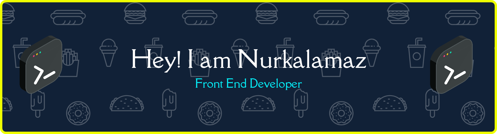

<h3 align="left">Hey 👋 What's up?</h3>

#####

My name is <b> Nurkalam Abdurrahman </b> and I'm a <b> Front End Developer </b>, from <b> Indonesia <b> 

###

<h5 align="left">About me</h5>

#####

  ✨ Exploring coding since 2022 
  📚 Currently enjoying learning React, Tailwind CSS, and APIs 
  🎯 Goal: Building cool, simple, and useful web applications 
  🎲 Fun fact: Sometimes I spend more time choosing UI colors than writing the code 😅

###

<h5 align="left">I code with</h5>

#####

  
  
  
  
  
  
  
  
  
  
  

###

<h5 align="left">Snake Games</h5>

#####

